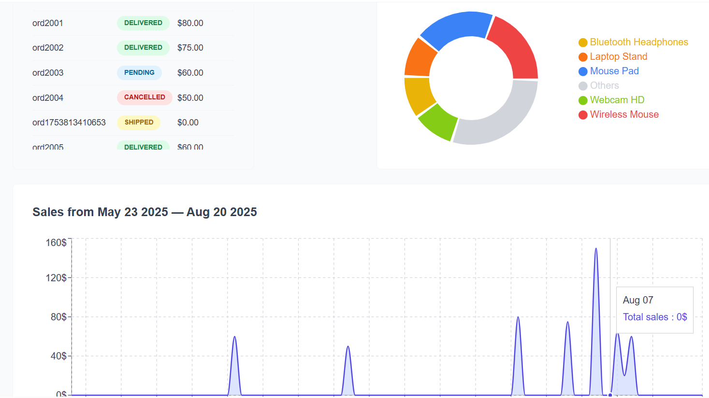
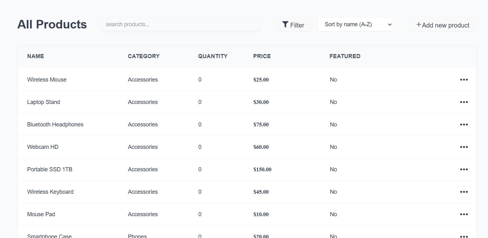
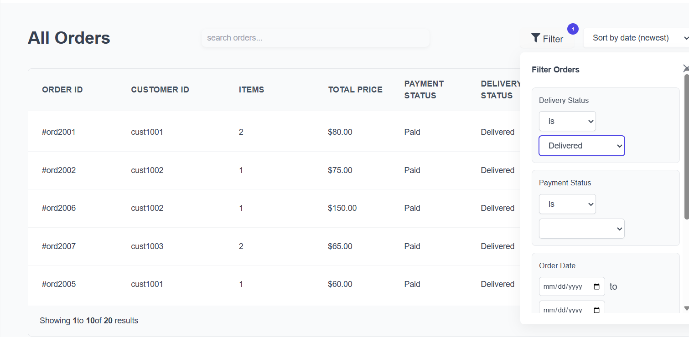
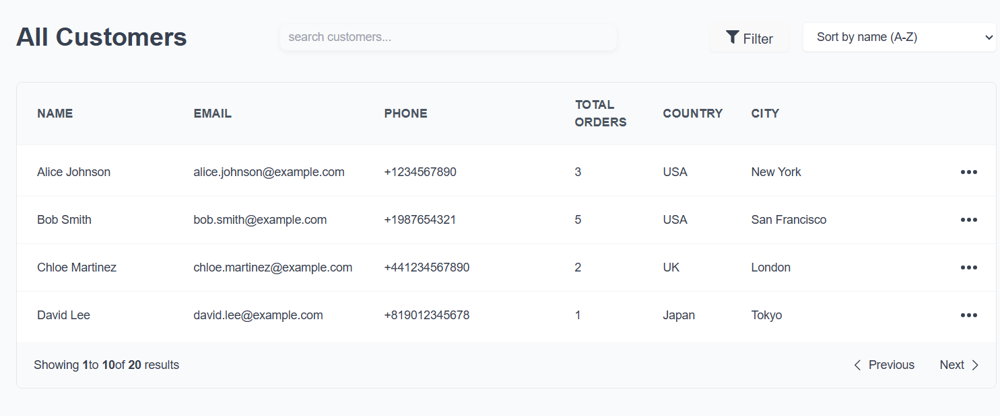

# Multi-Role E-commerce Platform

A modern, full-featured **React frontend MVP** of a multi-role e-commerce platform.  
Supports **guest shopping**, **registered customers**, and **seller/admin dashboards** with dynamic management of products, orders, and customers.  
Backend is mocked using [`json-server`](https://github.com/typicode/json-server).

> Note: Customer/store pages are **fully functional**, but UI styling is **pending**. Admin dashboard is fully styled.

---

## Screenshots

### Seller/Admin Dashboard


_Admin dashboard fully styled and functional._

### Product Management


_Dynamic filtering implemented for easy product search by category, name, or status._

### Order Management


_Dynamic filtering implemented to find orders by status, date, or customer._

### Customer Management


_Dynamic filtering to quickly locate customers by name, status, or purchase history._

---

## Project Overview

### Vision

Build a comprehensive e-commerce platform serving **guests, registered customers, and sellers/admins** with intuitive dashboards, dynamic management tools, and scalable architecture.

### Key Differentiators

- Multi-role architecture: Guest, Customer, Seller/Admin
- Full customer/guest logic implemented
- Dynamic filtering for products, orders, and customers
- Scalable component-based design for easy feature expansion

---

## Current Features

### Customer / Guest Features

**Product Browsing**

- Category-based navigation
- Product search and filtering
- Detailed product pages with images and descriptions
- Featured products showcase

**Shopping Cart**

- Add/remove products
- Quantity adjustment
- Real-time price calculation
- Persistent cart state

**Checkout System**

- Guest checkout (no account required)
- Multiple payment methods (COD, Card – mock)
- Shipping address management
- Order confirmation

**Order Management**

- Order history (for registered customers)
- Real-time order tracking
- Delivery status updates
- Order details and receipts

> Note: UI styling for customer/guest pages is still pending, but all core logic works.

---

### Seller / Admin Features

**Dashboard Analytics**

- Sales overview
- Order statistics
- Customer insights
- Revenue tracking

**Product Management**

- Add/edit/delete products
- Category management
- Inventory tracking
- Product image uploads (mock)
- Featured product settings
- Product archiving
- **Dynamic filtering** for products by category, name, or status

**Order Processing**

- Order queue management
- Order status updates
- Shipping information
- Payment status tracking
- Delivery confirmation
- Order cancellation
- **Dynamic filtering** for orders by status, date, or customer

**Customer Management**

- Customer database
- Purchase history
- Customer status tracking
- Contact information
- **Dynamic filtering** to find customers by name, status, or purchase history

---

### Authentication System

**Seller/Admin Authentication**

- Secure login system
- Protected route access
- Session management
- Logout functionality

**Role-based Access Control**

- Separate areas for guests, customers, and sellers/admins
- URL-based role determination
- Protected seller dashboard

---

## Technical Stack

### Frontend

- React 18 – Component-based UI library
- React Router – Client-side routing
- React Query – Server state management
- Styled Components – CSS-in-JS styling
- React Hook Form – Form management
- React Hot Toast – Notifications

### Development Tools

- JSON Server – Mock backend API
- Axios – HTTP client
- Context API – Global state management

### Architecture Patterns

- Custom Hooks – Reusable logic
- Component Composition – Modular UI
- Context Providers – Filter & state management
- Protected Routes – Authentication guards

---

## Getting Started

### 1. Clone the repo

```bash
git clone https://github.com/elhassanefek/multi-role-ecommerce-platform.git
cd multi-role-ecommerce-platform
```

### 2. Setup

```bash
npm install
npm run dev
```

### 3. Run json-server

```bash
json-server --watch data/storeData.json --port 9000
json-server --watch data/sellerData.json --port 9001
json-server --watch data/usersData.json --port 9002

```
